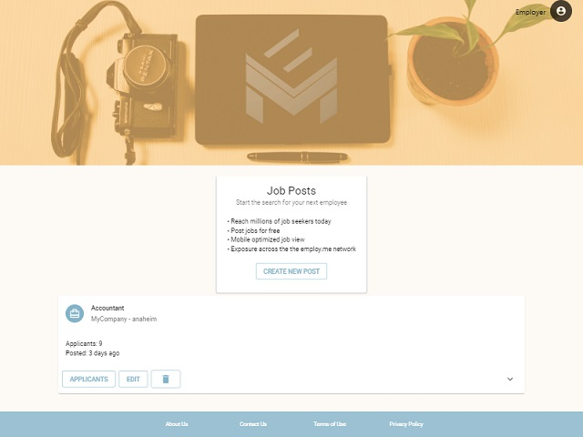

#  Employ<span></span>.me
> _employ<span></span>.me for employees._

A mobile-friendly employment solution with speed and ease in mind. Applicants to quickly create a profile, apply for jobs, and manage their activity. Applications are simple 1-click process; no extra steps for individual positions. Employers are able to create job post, view current listings, and access applicant contact information on each post.

## Usage
* Login with Google account  
* Create profile 
	*  Select Employer or Applicant profile type
* Start creating posts or applying!

 

## Deployment
Deployed to [Heroku](https://employ-me-app.herokuapp.com/)

## Development setup
Project uses node server environment. If you haven't already, install [Node.js](https://nodejs.org/en/download/)

Install dependencies:
```sh
npm i
```
Run Mongod process:
```sh
mongod
```
In a separate window, run Development Server:
```sh
npm start
```

## Release
* 2019/01/26 - Launch

## Contributors 
Jean Chung - [GitHub](https://github.com/jeannchung/)
Garrett Fermo - [GitHub](https://github.com/garrettcfermo)
Adam Openbrier - [GitHub](https://github.com/aOpenbrier)
Joleen Tsai - [GitHub](https://github.com/JoleenTsai)
